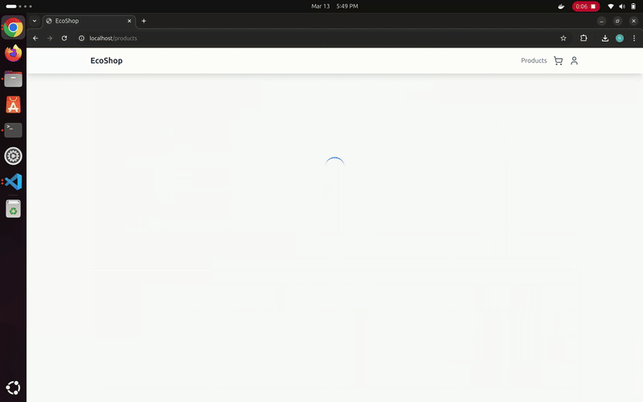
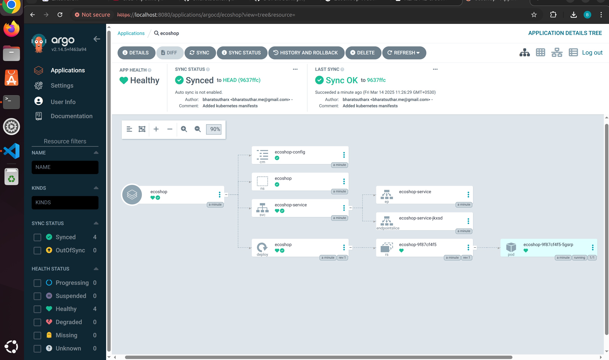
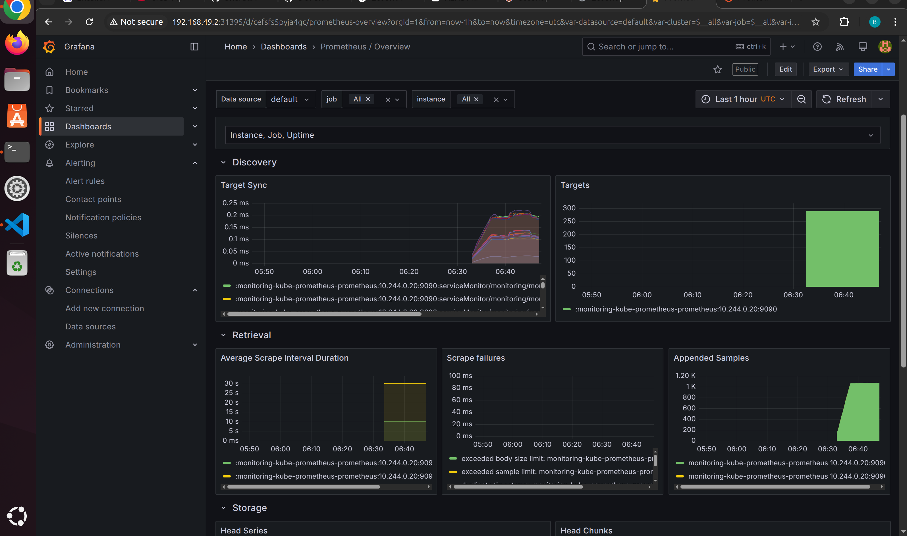

# EcoShop - DevOps Implementation

## Application Architecture

EcoShop is a **React + Vite + Supabase + Zustand** frontend project with the following architecture:

```
Client (Browser)
      ⬇️
Vite React App (Frontend)
      ⬇️
Supabase (Database)
```



### 🖥️ Frontend (React + Vite)
- **Vite**: Used for fast builds.
- **React**: Manages UI components.
- **Zustand**: Handles global state.
- **Tailwind CSS**: Provides modern styling.

### 🔗 Backend (Supabase)
Supabase acts as a backend replacement:
- **Database**: PostgreSQL
- **API access**: Managed via Supabase

### 🛠️ DevOps Stack
- **Containerization**: Docker
- **Orchestration**: Kubernetes (Minikube for local testing)
- **CI/CD**: Jenkins (Phase 1), GitHub Actions + ArgoCD (Phase 2)
- **Monitoring**: Prometheus, Grafana,  Alertmanager

## DevOps implementation 

###  Containerization (Docker) : Build a lightweight, production-ready Docker image.

- Use a **multi-stage build** to minimize image size.
- Use **Nginx** to serve the frontend.
- pass **environment variables**.

---

###  CI/CD Pipeline: GitHub Actions + ArgoCD 

Automate testing, building, and deploying the app

GitHub Actions, Docker Hub, Kubernetes, ArgoCD

Steps:

1. GitHub Actions - CI Pipeline

* Build & push Docker image to Docker Hub

2. GitHub Actions - CD Pipeline

* Deploy to Kubernetes cluster using ArgoCD

* Ensure automatic deployments via GitOps

* Kubernetes Deployment

* Create Deployment, Service, Ingress YAML files
* Expose the app using Nginx Ingress Controller

**I deployed kubernetes manifests and using argocd in minikube**

## Flow (How ArgoCD Deploys Your App in minikube) - 

*  I push the Kubernetes YAML files to GitHub inside the k8s/ folder.

* ArgoCD watches the repo and detects changes automatically.

*  ArgoCD pulls the latest manifests and applies them to Minikube.

*  Application is deployed inside Minikube just like running kubectl apply -f k8s/ but fully automated.



---

### : Monitoring & Logging
Set up end-to-end observability for the application.

####  Integrate Monitoring Tools
- **Prometheus + Grafana** for metrics
- **Loki + Grafana** for logs
- **Alerting** via Alertmanager + Slack/Email



---
